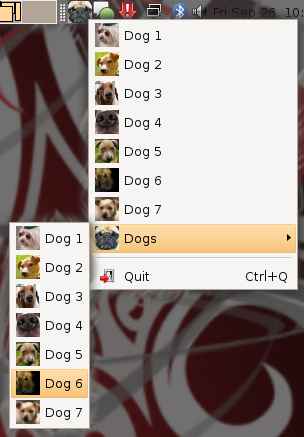

# simpletray

simpletray is a gem for making it really easy to make wxruby-based system tray applications



## BUG ALERT

Windows and OS X don't raise the required events for dynamically creating submenus.

I'm in the process of testing this and finding a workaround.

Hopefully, I can get this working on OS X.  For Windows, I'll be trying vruby / jruby / ironruby solutions.

Hopefully, this will work with native Ruby on Linux / OS X.

I'll be abstracting the GUI toolkit, so you can actually choose between Wx / Swing / WinForms / etc

## installation

### wx

simpletray uses [wxWidgets](http://www.wxwidgets.org), so you need to install it

A binary should be available for Windows users.  Mac/Linux should be able to use your packaging systems.
See [http://www.wxwidgets.org/downloads/#latest_stable](http://www.wxwidgets.org/downloads/#latest_stable) for latest wxWidgets releases.

For Windows, try [the Windows installer](http://prdownloads.sourceforge.net/wxwindows/wxMSW-2.8.9-Setup.exe)

For Mac OS X, try using [MacPorts](http://www.macports.org/):

    $ sudo port install wxwidgets

For Ubuntu Linux, try:

    # i *think* these are all the packages you need ... `aptitude search wx` to see all wx packages
    $ sudo aptitude install libwxbase2.8-0 libwxgtk2.8-0

### gems

now, install the required rubygems ...

    $ sudo gem install wxruby activesupport

and ... simpletray!

    $ sudo gem install remi-simpletray -s http://gems.github.com

## usage

```ruby
require 'rubygems'
require 'simpletray'

# icon my_cool_app.png will be used for the tray icon
SimpleTray.app "My Cool App" do

  # this makes a single item "About" (about.png will be used if found)
  # which pops up a message box when clicked
  about { msgbox "Hello!  This is my app!" }

  # this makes a submenu "Dogs" with rover/spot/rex subitems.
  # dogs.png, rover.png, spot.png, rex.png will all be looked for
  _dogs_  {
    rover { puts "..." }
    spot  { puts "..." }
    rex   { msgbox "w00f, my name is rex!" } 

    _more_dogs_ do
      another_dog     { puts "..." }
      yet_another_dog { puts "..." }
    end
  }

  # adds an item (the same as saying my_custom_item) with a custom icon
  item "My Custom Item", "custom-icon.png" do
    # ...
  end

  # adds an menu (the same as saying _my_custom_menu_) with a custom icon
  menu "My Custom Menu", "custom-menu-icon.png" do
    item1 { }
    item2 { }
  end

  # this adds a seperator and then a special "exit" item to quit the application
  ____
  exit

end
```

Also, see examples/first.rb (the first file I used for testing), which shows how to add 
your own helper methods

Note, currently I'm only supporting PNGs.  I'll fix this to support ICO/PNG/BMP/JPG/etc.
My TODO list is long  :P
